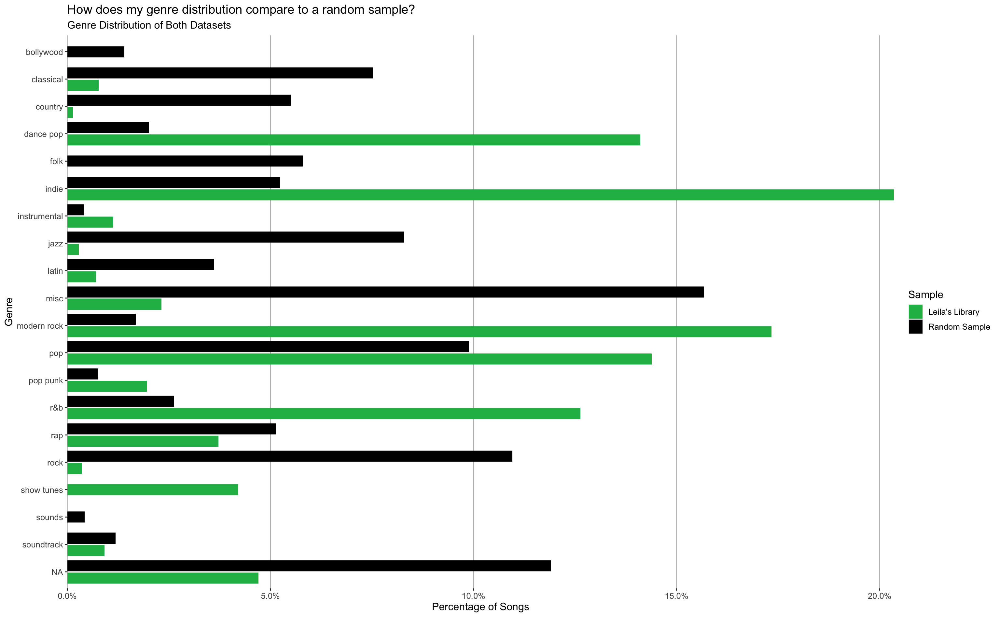
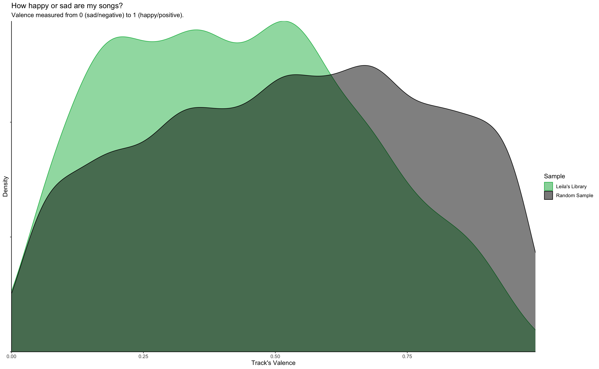

# Plugged In
## An Exploration into My Spotify Library

This past year I spent over 60,000 minutes listening to music on Spotify, and since creating my Spotify account in 2014, I have created over 100 playlists, curating music for every mood and encounter imaginable. Based on this alone, one might say I have a vested interest in my Spotify data, but when you combine that with my passion for data science, there is even more excitement when I am able to get a glimpse at what my streaming habits look like.

While Spotify Wrapped (Spotify's annual summary) provides a lot of interesting information, it often focuses more on top streams and genres rather than exploring the audio itself. Thus, when embarking on this project, I wanted to look more in depth at the characteristics of my song library itself rather than just looking at which artists showed up the most in my music. Additionally, I wanted the project to serve as an initial exploration for later recommendation and classification models I want to apply to my Spotify library.

The most interesting findings were that of how my music library differed from a random sample of Spotify's library. First, it showed that my library is composed a few genres that I listen to a lot of songs within, the most popular of which being indie music. In comparison, Spotify's catalog tended to be distributed across many genres, each making up a smaller portion of the total sample.

The actual audio features of my library also differed from that of Spotify's catalog. For one, my songs tended to be a bit more popular than the random sample (which makes sense as Spotify's catalog contains a lot of songs that are streamed by very few people in addition to the songs people gravitate towards because of their knowledge via pop culture, TikTok, or radio plays). What was surprising was that my songs tended to be more sad than the distribution of Spotify's catalog suggested they would be. I attribute this to enjoying listening to calming music that may present as sad and to my love of Phoebe Bridgers.

I found that, in general, my music taste differed from that of Spotify's overall catalog. While it is difficult to draw any conclusions about how my library compares to the average Spotify user, I do know that my music tended to be less cheerful as mentioned above, less likely to be acoustic, and more energetic than the distribution of Spotify's catalog. 
